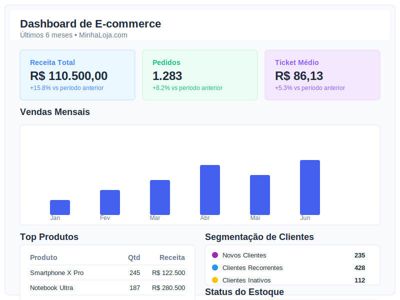
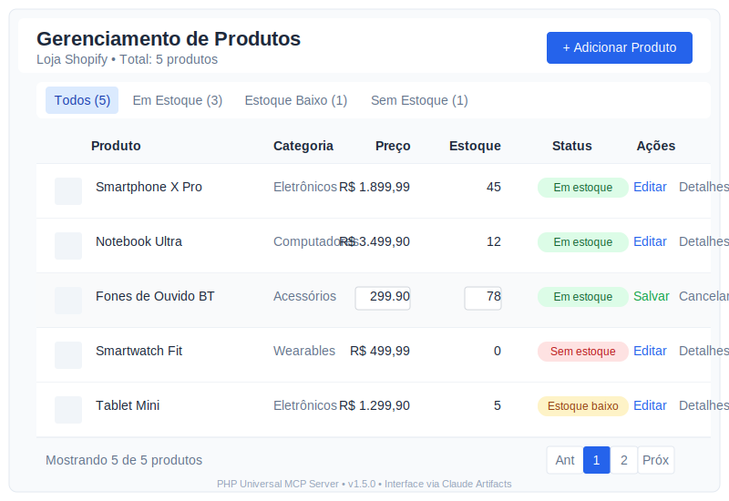

# Status do Projeto - PHP Universal MCP Server

## Visão Geral

O PHP Universal MCP Server é uma plataforma completa para gerenciamento de sites e e-commerces através do Claude Desktop, utilizando o Model Context Protocol (MCP). O projeto fornece uma interface unificada que permite aos usuários controlar hospedagem, design, produtos e administrativo de diversos sites usando apenas comandos em linguagem natural no Claude.

## Recursos Principais Implementados

### 1. Integração com Provedores
- ✅ **Hostinger Provider**: Gerenciamento completo de hospedagem, domínios e DNS
- ✅ **Shopify Provider**: Gerenciamento completo de lojas, produtos, pedidos e temas
- ⏳ **WooCommerce Provider**: Implementação parcial (em andamento)

### 2. Analytics e Visualizações
- ✅ **Dashboard de Analytics**: Métricas de desempenho via artifacts do Claude
- ✅ **Gerenciamento de Produtos**: Interface interativa para catálogos
- ✅ **Relatórios Detalhados**: Vendas, produtos, clientes e estoque
- ✅ **Documentação Visual**: Exemplos SVG e guias de uso

### 3. Core do Sistema
- ✅ **MCP Protocol Layer**: Implementação completa para comunicação com Claude
- ✅ **PHP Runtime Engine**: Ambiente seguro para execução de código
- ✅ **E-commerce Manager**: API unificada para gerenciamento de e-commerce

### 4. Design e Templates
- ✅ **Bootstrap Components**: Modal, Accordion, Gallery e outros
- ✅ **Templates Completos**: Blog, Landing Page, Dashboard
- ✅ **Sistema de Customização**: Personalização visual flexível

## Visualizações Interativas via Claude Artifacts

Uma das inovações mais importantes deste projeto é o uso de artifacts do Claude para proporcionar uma experiência visual rica diretamente na interface de chat. Ao contrário de soluções tradicionais que exigiriam um painel web separado, esta abordagem permite que os usuários visualizem e interajam com:

- **Dashboards de métricas**
- **Interfaces de gerenciamento**
- **Gráficos e visualizações**
- **Editores de templates**

Tudo isso sem sair do ambiente de chat do Claude Desktop.

### Exemplos de Visualizações Implementadas:

1. **Dashboard de Analytics**:
   

2. **Gerenciamento de Produtos**:
   

## Estado Atual (Versão 1.5.0)

O projeto está em fase avançada de desenvolvimento, com a maioria dos componentes principais implementados e funcionais. As principais realizações recentes incluem:

1. **Integração completa do Shopify Provider**
2. **Sistema de Analytics e Relatórios**
3. **Visualizações interativas via Claude Artifacts**
4. **Documentação abrangente com exemplos visuais**

### Métricas do Projeto:
- **Versão Atual**: 1.5.0
- **Componentes Principais**: 10 implementados
- **Provedores**: 2 completos, 1 em desenvolvimento
- **Visualizações**: 2 implementadas, mais planejadas
- **Documentação**: Completa e atualizada

## Próximos Passos

### Prioridade Alta:
1. **Finalizar WooCommerce Provider**
2. **Expandir Visualizações**:
   - Gerenciamento de pedidos
   - Configurações de hospedagem
   - Editor de templates visual

### Prioridade Média:
1. **Otimizar Experiência no Claude**:
   - Comandos mais naturais
   - Respostas contextualmente apropriadas
   - Sistema de sugestões inteligente

### Prioridade Baixa:
1. **Expansão para mais provedores**:
   - AWS, GCP, Azure
   - Magento, PrestaShop
2. **Sistema de plugins**

## Como Contribuir

O PHP Universal MCP Server é um projeto de código aberto e aceita contribuições. As áreas mais necessitadas de contribuição atualmente são:

1. **Finalização do WooCommerce Provider**
2. **Mais visualizações via Claude Artifacts**
3. **Melhorias de desempenho e otimizações**
4. **Testes automatizados adicionais**

Para contribuir, siga o guia em CONTRIBUTING.md.

## Conclusão

O PHP Universal MCP Server representa um avanço significativo na forma como usuários podem gerenciar sites e e-commerces através de interfaces conversacionais. A combinação do MCP com a capacidade de artifacts do Claude cria uma solução única que elimina a necessidade de interfaces web tradicionais, proporcionando uma experiência completamente integrada no ambiente de chat.

O projeto continuará a evoluir para incluir mais provedores e visualizações, mantendo o foco na simplicidade para o usuário final e na potência das ferramentas disponibilizadas.

---

*Última atualização: 23 de março de 2025*